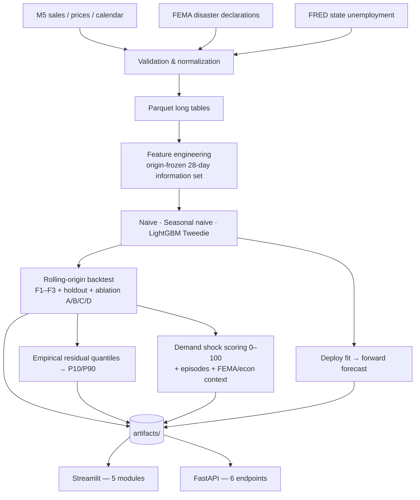

# DemandShock

**Crisis-Aware Demand Forecasting & Inventory Intelligence Platform**

> Retail intelligence for when historical demand patterns stop behaving normally.

Traditional forecasting asks *what will demand be?* DemandShock also asks **where is
actual demand departing from expectation, what real-world conditions coincided with
it, how important is the deviation, and what should a planner do about it?**

It is a **decision-support platform**, not an autonomous inventory system, and it is
built entirely on real data: the M5 retail dataset, FEMA disaster declarations and
FRED state unemployment. No synthetic records, no simulated crises, no invented
inventory, no placeholder metrics.

Measured results live in **[RESULTS.md](RESULTS.md)**, which is generated from the
artifacts by `scripts/export_results.py` — no figure in it is typed by hand.

---

## The business problem

Retail planners forecast well enough in ordinary conditions. The expensive failures
happen when demand stops behaving normally — a product's demand regime shifts, a
category surges, a store's pattern breaks — and nobody notices for weeks. Standard
forecasting tools report an average error; they do not say *this series broke, here
is how badly, here is what else was happening, and here is what it is worth.*

DemandShock closes that gap by treating the **forecast residual as a signal**, not
just an error term.

## What it does

| Question | Where it is answered |
| --- | --- |
| What is likely to happen to demand? | Module 2 — forecasts with P10–P90 intervals |
| Where is demand behaving abnormally? | Module 3 — demand shock scoring |
| Did unusual patterns coincide with real disruptions? | Module 3 — FEMA/FRED context |
| Which products and stores need attention? | Modules 1 and 3 |
| What inventory does the forecast imply? | Module 4 — planning arithmetic |
| How reliable is the model? | Module 5 — backtests, ablation, intervals |
| What drives the forecasts? | Module 5 — exact TreeSHAP attribution |
| What financial exposure does forecast error create? | Modules 1 and 4 |

---

## Architecture



Everything user-facing reads **precomputed artifacts only**. The app and the API
never train, never touch raw CSVs and never load a feature matrix, so UI
responsiveness is decoupled from training scale.

---

## Data sources

| Dataset | What it provides | Notes |
| --- | --- | --- |
| **M5 Forecasting – Accuracy** | 30,490 daily item×store series, 2011-01-29 → 2016-06-19, weekly sell prices, retail calendar with events and SNAP flags | Primary demand data. `sales_train_evaluation.csv` is canonical. |
| **FEMA OpenFEMA v2** | Disaster declarations (type, incident type, dates, designated counties) | County-level rows deduplicated to one row per `disasterNumber`. |
| **FRED / BLS** | Monthly state unemployment for CA, TX, WI | Joined with a publication lag so the model cannot see unreleased figures. |

**NOAA weather is deliberately out of scope** in this version. No feature, page or
endpoint depends on it; it is documented only as a possible extension.

See [`data/raw/README.md`](data/raw/README.md) for exact file layout and download links.

---

## The five modules

1. **Executive command centre** — accuracy, bias, severe shocks and dollar exposure
   for the last evaluated 28 days, with the item-store pairs that concentrate the risk.
2. **Forecasting intelligence** — forecast vs actual by hierarchy and horizon, with
   uncertainty bands, model comparison, fold stability, worst-performing segments and
   the residual distribution.
3. **Crisis & demand shock intelligence** — the differentiator. Scored deviations,
   classified episodes, a fully auditable "why was this flagged?" panel, and
   coinciding FEMA declarations stated as coincidence, never cause.
4. **Inventory & business impact** — measured exposure from real prices, plus
   planning arithmetic that appears only once you supply operating assumptions.
5. **Model, explainability & data quality** — the honest ablation verdict, held-out
   benchmarks, exact TreeSHAP attribution and every data-quality check.

---

## Forecasting methodology

**One global LightGBM, direct multi-horizon, Tweedie objective.**

The single invariant that everything else follows from:

> Every feature for target date `t` is computable from information available at the
> forecast origin `O = t − 28 days`, or is genuinely known in advance (retail
> calendar, SNAP schedule, published weekly price).

That means demand lags start at 28, rolling windows are applied to `y.shift(28)`, and
FEMA/FRED tables are joined at `date − 28 days` — the state of the world as known at
the origin. One vectorised predict call covers the whole 28-day path; horizons 7/14/28
are prefixes of it.

**Why direct rather than recursive.** With over half of item-days at zero, feeding
fractional predictions back into integer-heavy lag features compounds distribution
shift across 28 steps and would contaminate the very residuals the shock module
depends on. Direct forecasting also means training and inference share one feature
function, so there is no second implementation to drift out of sync.

**The honest cost**, stated in the app: a 7-day-ahead forecast sees demand only as of
28 days earlier. That is why **seasonal-naive-28 is the primary benchmark** — it
shares that information set exactly, making the comparison fair.

**Features (47 total, cumulative ablation arms):**

| Family | Examples |
| --- | --- |
| Demand (14) | `lag_28…lag_56`, rolling mean/std over 7/28/56 days on the shifted series, `zero_rate_28`, `days_since_last_sale` |
| Calendar (12) | weekday, day of month, week of year, SNAP for the store's own state, event names/types, days to/since events |
| Price (5) | `sell_price`, weekly change, price relative to a 52-week trailing mean, 4-week momentum |
| FEMA (7) | active declaration count, major-declaration flag, incident-type flags, days since declaration, designated-county extent |
| FRED (4) | unemployment level and 1-month, 3-month and year-over-year changes |
| Identity (5) | item, department, category, store, state as native categoricals |

**Validation is chronological only** — rolling-origin folds F1–F3, then a holdout
opened once after feature-set selection, then a forward forecast beyond the data.
Random splitting appears nowhere.

**Metrics:** MAE, RMSE, RMSSE, WAPE, sMAPE and forecast bias. The official M5
**WRMSSE is not implemented, so it is never claimed** — a test enforces that the name
appears nowhere as a result.

**Uncertainty:** empirical P10/P90 from out-of-sample residuals grouped by store,
category and forecast level, with coverage measured on the untouched holdout and
reported whatever it turns out to be.

---

## Shock detection methodology

A shock is **not** high demand. It is a day where actual demand departed from what the
model could reasonably have expected, in a way that is large relative to that series'
own recent error, and/or persistent, and/or accompanied by changed volatility or a
changed demand level.

**Residuals come from ablation arm B** (demand + calendar + price, no FEMA or FRED).
If crisis features were in the model, crisis-driven deviations would be partly
absorbed into the prediction and vanish from the residual — blinding the detector to
exactly what it exists to find.

Five signals, each squashed to 0–1 by a piecewise-linear cap, then weighted to 100:

| Signal | Weight | Measures |
| --- | --- | --- |
| Standardised residual | 35 | Deviation relative to the series' own recent forecast error |
| Percentage deviation | 20 | Deviation relative to recent average demand |
| Persistence | 20 | Consecutive same-direction days |
| Volatility ratio | 10 | Short-term error spread against longer-term spread |
| Level shift | 15 | Change in the demand level itself, not just the error |

Piecewise-linear rather than a sigmoid so **every point of the score is attributable**
and the arithmetic in the "why was this flagged?" panel reconciles by hand.

**Guards against false positives:** a low-volume damping multiplier so a 0→2 unit move
on a slow mover cannot read as a crisis; a hard zero for a zero-sale day against a
near-zero forecast; an eligibility gate excluding series with too little non-zero
history; and a warm-up cap. The residual dispersion is **frozen at its pre-episode
value while an episode is open**, so a long episode cannot inflate its own baseline
and silently damp its later days.

**Bands:** Normal 0–29 · Watch 30–49 · Elevated 50–69 · Severe 70–84 · Critical 85–100.

**Episodes** seed at 30, bridge a single quiet day, and close after two. Each is
classified as Demand Surge, Demand Collapse, Volatility Shock, Persistent
Under/Over-forecast, or Regime Shift — where a regime shift requires sustained
duration *and* a level change confirmed by the days after the episode.

> The demand shock score is a **project-defined metric**, not a validated industry
> standard, and the platform says so on the page.

---

## Interpretation versus causation

This is enforced in code and in tests, not just in prose.

**Allowed:** "A FEMA disaster declaration was active in this state during part of this
period." · "State unemployment was 5.4% in this month."

**Never stated:** that a disaster caused a demand change, or that unemployment drove
sales. FEMA declarations are county-scoped while M5 discloses only a store's state, so
disaster information is a state-level temporal coincidence. A test asserts that words
like *caused*, *due to* and *triggered* never appear in generated context sentences.

---

## Inventory methodology

M5 contains **no inventory records** — no on-hand stock, no lead times, no service
levels, no costs. The module therefore separates two things:

**Measured from real data (always shown):** forecast demand, the model's own
out-of-sample error dispersion, real sell prices, and *Estimated Revenue Exposure* —
forecast error valued at real prices, split into under-forecast and over-forecast
directions. This is **exposure, not measured lost revenue**: M5 records units sold, so
unmet demand is unobservable.

**Requires your operating assumptions (labelled `USER INPUT`, never pre-filled):**

```
lead-time demand = sum of daily forecasts over the lead time
safety stock     = z × sigma_daily × sqrt(lead_time)      z = normal quantile at your service level
reorder point    = lead-time demand + safety stock
days of cover    = on-hand units / mean daily forecast
```

`sigma_daily` is the standard deviation of that series' own out-of-sample daily errors
— measured, not assumed. A conservative perfectly-correlated bound
(`sigma × lead_time`) is shown alongside the independence assumption.

---

## Installation

Requires Python 3.11+ (developed and verified on 3.14).

```bash
pip install -r requirements.txt
python scripts/smoke_deps.py
```

The smoke test exercises every library call the pipeline relies on — including
LightGBM's `pred_contrib` TreeSHAP identity and the pandas shift-before-rolling
behaviour — so environment problems surface before anything else runs.

## Running it

```bash
python scripts/run_pipeline.py --mode development
```

Then:

```bash
streamlit run app/Home.py
```

```bash
uvicorn api.main:app --reload
```

**Development mode** uses a real M5 subset (one store, one category, 200 real items)
so the whole pipeline finishes in minutes. It is a *subset of real data*, never
generated data. **Full mode** (`--mode full`) runs all 30,490 series.

Individual stages, if you want them separately:

```bash
python scripts/prepare_data.py --mode development
```

```bash
python scripts/train.py --mode development
```

```bash
python scripts/evaluate.py --mode development
```

```bash
python scripts/export_results.py
```

## Tests

```bash
python -m pytest -q
```

The suite is release-gating and covers:

- **Leakage** — the core invariant is proved directly: perturbing actuals inside
  `(t−28, t]` must leave every feature at `t` bit-identical, with a control test
  showing day `t−28` *does* move them. Plus fold isolation, the FEMA
  pre-declaration window, the FRED publication boundary, price joins and SNAP
  state mapping.
- **Metrics** — hand-computed MAE/RMSE/WAPE/sMAPE/bias, the RMSSE scaling
  denominator, degenerate-series exclusions, and a check that WRMSSE is never claimed.
- **Shock** — score arithmetic reconciliation, determinism, low-volume guard,
  warm-up cap, sigma freezing, episode bridging, and absence of causal language.
- **Inventory** — z values, safety stock, reorder point, lead-time clamping, exposure,
  and that nothing inventory-dependent is produced without user input.
- **API** — schemas, 404/422/503 paths, and empty results returning 200.

## Docker

```bash
docker build -t demandshock .
```

```bash
docker run -p 8501:8501 -v "$(pwd)/datasets:/app/datasets" demandshock
```

---

## Repository layout

```
demandshock/
├── app/                    Streamlit — Home + 5 module pages + shared.py
├── api/main.py             FastAPI — 6 read-only endpoints
├── src/demandshock/        config, data, features, forecasting, metrics,
│                           shock, inventory
├── scripts/                smoke_deps, prepare_data, train, evaluate,
│                           export_results, run_pipeline
├── tests/                  leakage, metrics, shock, inventory, API
├── data/processed/         Parquet tables built by the pipeline
├── artifacts/              Forecasts, metrics, shocks, importance, reports
├── config.yaml             Every threshold, path, fold and weight
└── RESULTS.md              Generated from artifacts — never hand-written
```

---

## Known limitations

- **No inventory data exists in M5.** Safety stock, reorder points and days of cover
  require operating assumptions the user supplies.
- **FEMA is county-scoped; M5 gives only a store's state.** Disaster context is a
  state-level temporal coincidence and is never presented as causal.
- **FRED unemployment is monthly.** It cannot explain a daily deviation and is used as
  slow-moving background context.
- **Shock detection is retrospective.** Residuals exist only where the model forecast
  out of sample, so shocks are measured on days that already happened. M5 ends
  2016-06-19; there is no live period.
- **The official M5 WRMSSE is not implemented** and is never quoted.
- **sMAPE is unstable on intermittent demand** and is labelled as such wherever shown.
- **No formal forecast reconciliation.** Aggregation across the hierarchy is bottom-up.
- **No causal inference.** External signals are treated as association only.
- **Weather is out of scope** in this version.

## Responsible use

The platform is decision *support*. Forecasts carry uncertainty that is displayed
rather than hidden; bad segments are surfaced rather than buried; the ablation verdict
is auto-generated from the numbers and says plainly when external data did not help.
Human review belongs between any output here and an ordering decision.

## Possible extensions

- NOAA weather as an additional context signal (data is already on disk, deliberately unused)
- Per-horizon models for short horizons, to recover the information the 28-day freeze gives up
- Formal hierarchical reconciliation (MinT or similar)
- Conformal prediction intervals with finite-sample guarantees
- A causal design (event studies around declarations) to move FEMA from context to inference
